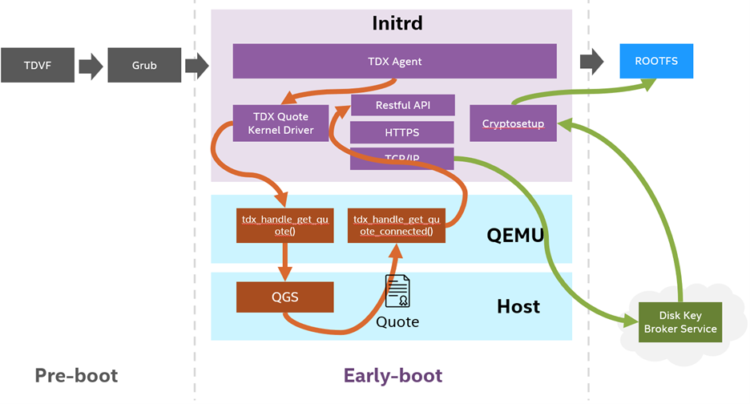

# TDX Full Disk Encryption

Full disk encryption (FDE) is a security method for protecting sensitive
data by encrypting all data on a disk partition. FDE shall encrypt data
automatically to prevent unauthorized access.
This project is a FDE solution based on [Intel&reg; Trust Domain
Extensions(Intel TDX)](https://www.intel.com/content/www/us/en/developer/articles/technical/intel-trust-domain-extensions.html).

## Architecture



## Preparation

We build the Ubuntu 22.04 guest image on the Ubuntu 22.04 host, and validate it. If you work in other environment, please adapt scripts in the below sections carefully (not recommended).

**Note: The default FDE solution is just a reference implementation. Both fde-agent and fde-image.sh depend on an available KBS (Key Broker Service). Otherwise they cannot work. Please modify fde-agent code to add KBS information before running the solution. The detail can be found in [retreive_key_from_kbs](https://github.com/cc-api/full-disk-encryption/blob/3c4325c7a6b4d2fe76aa0b873920bf981c46db41/src/key_broker.rs#L20).**

### 1. Register a key

The `key` to encrypt the image disk is distributed by the KBS, besides, which will bind a unique `keyid` with the `key`. The `keyid` is the key's identifier in the KBS. Consult your KBS to get a pair of key and key_id.

### 2. Build the fde-agent

The fde-agent is placed in the `FDE_DIR=attestaion/full-disk-encryption`.

The fde-agent is responsible for decrypting a guest image and mounting it as the rootfs. The fde-agent depends on dynamic libraries `libtdx-attest` and `libtdx-attest-dev` in `DCAP`. The `DCAP` can be downloaded from [official website](https://download.01.org/intel-sgx/sgx-dcap/). Please get the correct version of DCAP and install the libraries. Then build the fde-agent by the following commands.

```
make clean -C ../full-disk-encryption
make -C ../full-disk-encryption
```

### 3. Create FDE image

There are several ways to create FDE image. The [wiki page](https://help.ubuntu.com/community/Full_Disk_Encryption_Howto_2019) in Ubuntu community provides a base knowledge. Besides, install fde-agent and initramfs-tools in this repo. Finally, append the option `cryptdevice` in the kernel command (refer [link](https://wiki.archlinux.org/title/dm-crypt/System_configuration)) and then update the Grub config.

```
cd ${FDE_DIR}/attestation/full-disk-enryption/tools/image
./fde-image.sh -k $KEY -i $KEY_ID -d ${TDX_REPO_LOCAL}
```

The `KEY=key` and `KEY_ID=keyid` are retrieved in step 1. The `TDX_REPO_LOCAL` is built from `tdx-tools`.

### 4. Enroll variables to OVMF

Install [ovmfkeyenroll](/tools/ovmfkeyenroll/) tool.

```
pip3 install ovmfkeyenroll
```

Enroll Key Broker Service (KBS) information to OVMF

1. KBS URL

```
NAME="KBSURL"
GUID="0d9b4a60-e0bf-4a66-b9b1-db1b98f87770"
DATA="url.txt"
python3 tools/image/enroll_vars.py -i OVMF.fd -o OVMF_FDE.fd -n $NAME -g $GUID -d $DATA
```

2. KBS Certificate

```
NAME="KBSCert"
GUID="d2bf05a0-f7f8-41b6-b0ff-ad1a31c34d37"
DATA="cert.cer"
python3 tools/image/enroll_vars.py -i OVMF_FDE.fd -o OVMF_FDE.fd -n $NAME -g $GUID -d $DATA
```

3. KBS User Data

```
NAME="KBSUserData"
GUID="732284dd-70c4-472a-aa45-1ffda02caf74"
DATA="userdata.txt"
python3 tools/image/enroll_vars.py -i OVMF_FDE.fd -o OVMF_FDE.fd -n $NAME -g $GUID -d $DATA
```

It is recommended to use a json structure to save the userdata, at least including the `keyid` item retrieved in step 1. You can customize the enrolled data, detail in `src/ovmf_var.rs`

```
# cat userdata.txt
{
    "keyid":"sth"
}
```

### TDX tools

The script `start-qemu.sh` helps launch a TDX guest from an encrypted guest image built through above steps.

## Validation

Launch a tdvm guest by the following command.

```
OVMF_PATH=/path/to/OVMF
IMAGE_PATH=/path/to/image

start-qemu.sh \
    -b grub \
    -q tdvmcall \
    -o ${OVMF_PATH} \
    -i ${IMAGE_PATH}
```

Verify the encryption status by running the command in the tdvm guest.

```
blkid
```

The TYPE of encrypted partition should be `crypto_LUKS`

```
/dev/vda1: UUID="79c64ac3-c2c2-479b-bbd8-ea9c7d5cf29f" LABEL="cloudimg-rootfs-enc" TYPE="crypto_LUKS"
```
